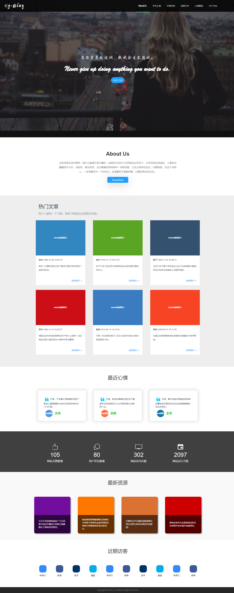
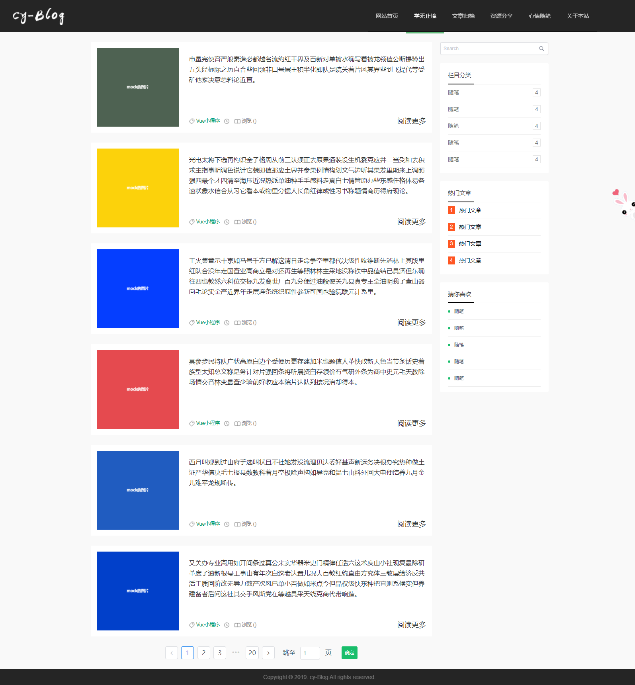
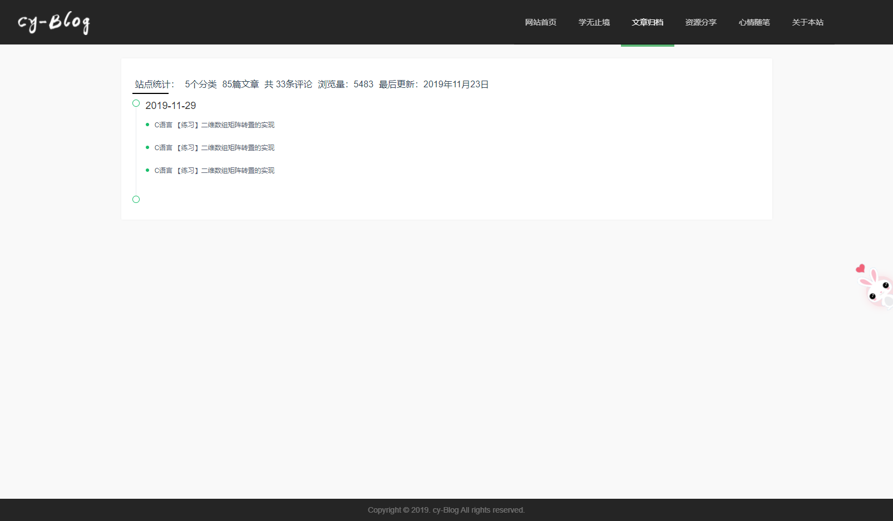
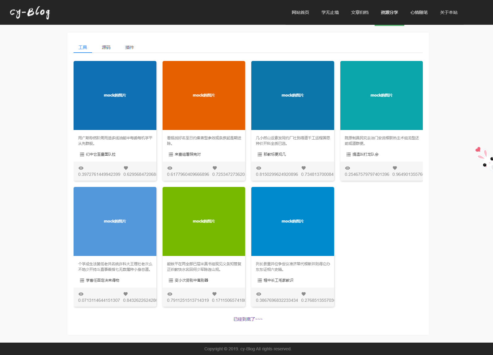

#### 个人博客

#### 安装相关依赖

npm install

#### 运行项目
npm run serve

#### 项目中大概用到的技术栈

Vue + iView + vue-awesome-swiper(轮播插件) + vue-count-to (数值滚动插件) + wowJs(动画插件) + mockJs(模拟数据)

##### 其他
* 对导航条样式进行修改
```
/*定义滚动条轨道*/
::-webkit-scrollbar-track {
  background-color: transparent;
  -webkit-border-radius: 2em;
  -moz-border-radius: 2em;
  border-radius: 2em
}
/*定义滑块 内阴影+圆角*/
::-webkit-scrollbar-thumb {
  background-color: #0093ff;
  background-image: -webkit-linear-gradient(45deg,rgba(255,255,255,.4) 25%,transparent 25%,transparent 50%,rgba(255,255,255,.4) 50%,rgba(255,255,255,.4) 75%,transparent 75%,transparent);
  -webkit-border-radius: 2em;
  -moz-border-radius: 2em;
  border-radius: 2em;
}

```








